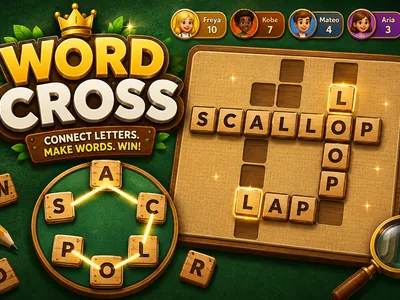
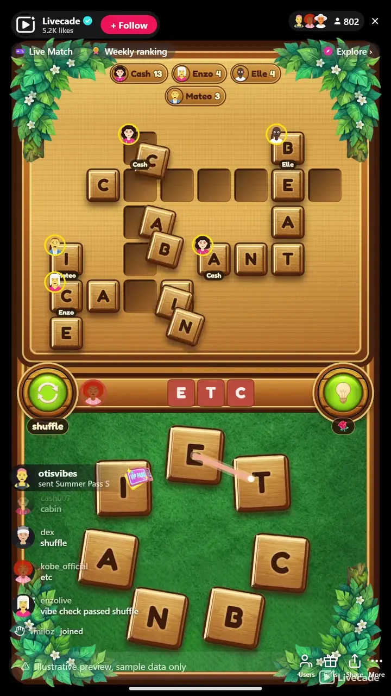

# Word Cross - Interactive TikTok Live Game

> One shared rack of letters, a board of crossing words, and the whole chat solving it together.

One rack of letters, a board of crossing words, and a whole chat guessing at once. Every word on the board is spelled from the same letters, so solving one hands everyone a clue to the rest. No clues to read, no turns to wait for.

**[Play Word Cross on Livecade](https://livecade.io/games/word-cross/?utm_source=github&utm_medium=readme&utm_campaign=word-cross)** - runs as a single browser source in OBS, Streamlabs, or TikTok LIVE Studio. Nothing for viewers to install.

## How viewers play

Viewers take part with the actions TikTok already gives them: **comments**, **gifts**. Every action below is rebindable, so you decide which interaction drives which effect.

| Action | What it does |
| --- | --- |
| **Guess a word** | Any comment is checked against the unsolved words. A match traces across the rack, flies into the board, and credits the viewer with their avatar on the word |
| **Reveal a letter** | A gift uncovers one letter of the longest word still hidden, credited to the gifter. If it completes the word, they are credited with the solve and the points |
| **Shuffle the letters** | A keyword in chat rearranges the ring, sliding every tile to a new place. Purely cosmetic, for when the crowd has stared at the same arrangement too long |

## How it works

### Every word comes from one rack

Four to six words cross on the board, and all of them are spelled from the same letters shown on the felt. Nothing is hidden knowledge, so a viewer can join at any second and start guessing from what is on screen.

### Solving a word helps with the rest

A solved word drops its letters into the squares it shares with the words still hidden, so the board gets easier as chat works through it. That is what makes it collaborative instead of a race.

### The star word pays double

The longest word that is not the rack word carries a gold star. The rack word is usually the most obvious solve, so the star sits on something worth chasing.

## About the game

Word Cross puts a wooden puzzle board on your stream and lets the entire chat solve it together. The board holds four to six words that cross each other, and every one of them is spelled from a single shared rack of letters sitting on the felt below. The rack is visible, so there is nothing to look up and nothing to know in advance, and solving one word reveals letters that sit inside the words still hidden.

### The board fills with the faces who built it

A viewer types a word in chat and, if it matches, the letters trace across the rack, fly into their slots, and land with a burst of gold. Their avatar stays pinned to the first tile of the word they solved. The longest word that is not the rack word carries a gold star and pays double, and when it falls the stars fly off the board, which gives every puzzle a target beyond finishing it.

### No strikes, no countdown, no punishment

There is no penalty for a wrong guess: a board stays up until the words are found, so a quiet chat is never punished for being slow. Gifts reveal a letter of the longest word still hidden, credited to the sender, and if that letter completes the word they are credited with the solve. When the crowd stalls, typing shuffle rearranges the ring and the tiles visibly slide to their new places.

### 8,412 puzzles across ten languages

Every one is generated and checked offline so a layout never fails live, and no puzzle repeats until the whole language has cycled. Matching is exact once accents are folded, so a phone-typed word still counts.

## What it looks like on stream

[Watch Word Cross gameplay](https://cdn.livecade.io/games/word-cross.mp4)

## What you can configure

- **Language** - Ten languages, each with its own generated puzzle bank
- **Puzzles per match** - Up to twenty, or endless
- **Seconds between guesses per viewer** - A per-viewer cooldown so one person cannot spam the board
- **Seconds between letter shuffles** - A shared cooldown, so the rack cannot be spun constantly
- **Show who solved each word** - Pins the solver avatar and name to the word they got
- **Viewer scoreboard** - Carved into the top of the cabinet, showing who is playing
- **Background colour** - Or transparent, to sit over your camera
- **Your puzzle bank** - Hide, restore or export any puzzle in your language from the content manager

## Languages

English, Spanish, Portuguese, French, German, Italian, Indonesian, Turkish, Russian, Romanian

## FAQ

<strong>How do viewers play Word Cross?</strong>

They type a word in chat. Every word on the board is spelled from the rack of letters shown on screen, so there is nothing to look up and no way to be behind. A correct word traces across the rack, drops into the board, and keeps their avatar on it for the rest of the puzzle.

<strong>What happens on a wrong guess?</strong>

Nothing. There are no strikes and no penalty, because the game is cooperative. The word is shown in the tray and the tray shakes, so the viewer can see their attempt was read, and a word someone already solved is ignored quietly rather than marked wrong.

<strong>Is there a time limit?</strong>

No. A board stays up until its words are found, so a slower chat is never cut off mid-puzzle and a quiet moment does not cost anyone the round. You can move to the next puzzle yourself whenever you want.

<strong>What do gifts do?</strong>

A gift reveals one letter of the longest word still hidden, credited to whoever sent it. If that letter is the one that completes the word, the sender is credited with the solve and takes the points, so a gift always lands somewhere visible.

<strong>What does shuffling do?</strong>

Typing your shuffle keyword rearranges the ring of letters, and the tiles visibly slide to their new places. It is purely cosmetic, since the same letters spell the same words, but a fresh arrangement often shakes a word loose when the crowd is stuck. A shared cooldown keeps it from being spun constantly.

<strong>How many puzzles are there?</strong>

8,412 across ten languages, generated offline and checked before shipping so a broken layout can never appear mid-stream. Puzzles do not repeat until your language has cycled all the way through.

<strong>Do accents and spelling count?</strong>

A word matches once accents are folded, so typing casa on a phone still matches casă. Matching is otherwise exact, because the rack is small and visible and a typo allowance would start matching other valid words on the same board.

<strong>How do I add Word Cross to my TikTok Live?</strong>

Add one browser source URL to OBS or your streaming software and go live. There is no plugin to install and nothing for your viewers to download.

## Setup

1. [Create a Livecade account](https://app.livecade.io/register?utm_source=github&utm_medium=cta&utm_campaign=word-cross)
2. Copy your overlay browser source URL
3. Paste it into OBS, Streamlabs, or TikTok LIVE Studio
4. Pick Word Cross, set your triggers, and go live

Runs in the browser, so it works on Windows and macOS with nothing to download. [See all TikTok Live games](https://livecade.io/tiktok-live-games/?utm_source=github&utm_medium=readme&utm_campaign=word-cross).

---

_This repository documents Word Cross, a hosted interactive game by [Livecade](https://livecade.io/?utm_source=github&utm_medium=footer&utm_campaign=word-cross). The game runs on Livecade's platform, so there is no source to install here._
